# SLMkIII Programmer's Guide - Extracted Notes

- source: `docs/SLMkIII_Programmer's_Guide.pdf`
- rendered pages: `docs/slmkiii-guide-pages/page-XX.png`

## Key InControl API Highlights

- SysEx header for InControl API: `F0 00 20 29 02 0A 01 ... F7`
- Set Screen Layout command: `0x01` (Empty/Knob/Box).
- Set Screen Properties command: `0x02` with repeated property blocks.
- Set Notification Text command: `0x04` with two null-terminated text lines.
- Knobs (`CC21..28`) are two's-complement relative deltas in InControl mode.
- Faders (`CC41..48`) are absolute `0..127`.
- Soft Buttons use `CC51+` press/release semantics (`127/0`).

## Page 1


```text
Programmer’s Reference Guide
```

## Page 2

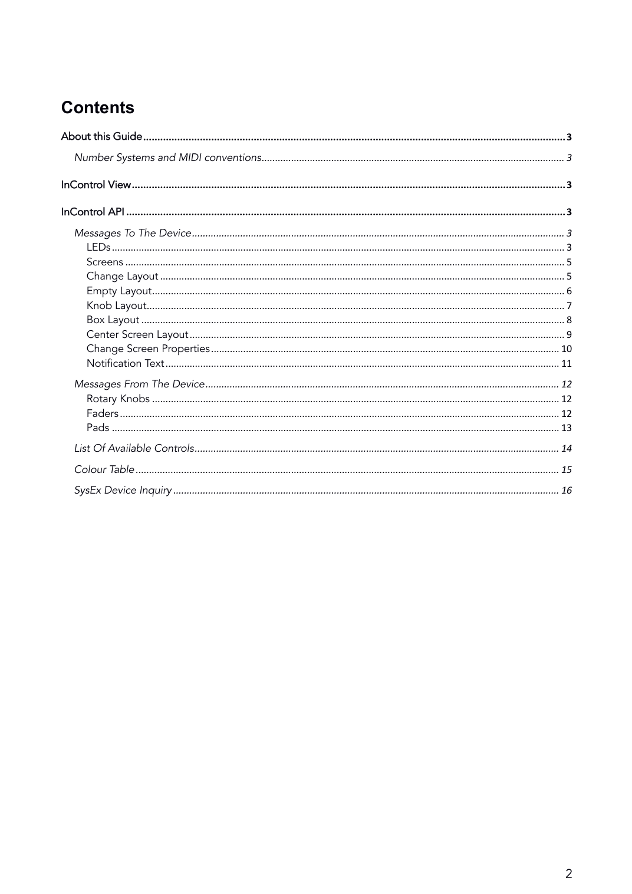

```text
2 
 Contents About this Guide ..................................................................................................................................................... 3 Number Systems and MIDI conventions ................................................................................................................. 3 InControl View ......................................................................................................................................................... 3 InControl API ........................................................................................................................................................... 3 Messages To The Device ........................................................................................................................................... 3 LEDs ......................................................................................................................................................................... 3 Screens .................................................................................................................................................................... 5 Change Layout ....................................................................................................................................................... 5 Empty Layout .......................................................................................................................................................... 6 Knob Layout ............................................................................................................................................................ 7 Box Layout .............................................................................................................................................................. 8 Center Screen Layout ............................................................................................................................................ 9 Change Screen Properties .................................................................................................................................. 10 Notification Text ................................................................................................................................................... 11 Messages From The Device .................................................................................................................................... 12 Rotary Knobs ........................................................................................................................................................ 12 Faders .................................................................................................................................................................... 12 Pads ....................................................................................................................................................................... 13 List Of Available Controls ........................................................................................................................................ 14 Colour Table .............................................................................................................................................................. 15 SysEx Device Inquiry ................................................................................................................................................ 16
```

## Page 3

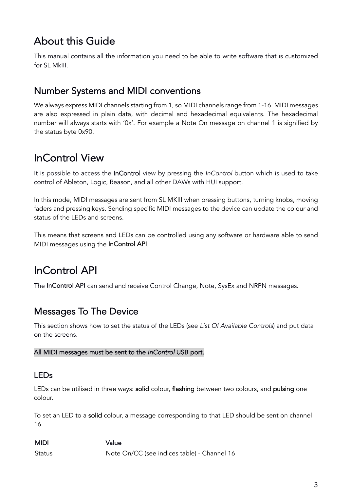

```text
3 
About this Guide This manual contains all the information you need to be able to write software that is customized for SL MkIII.  Number Systems and MIDI conventions We always express MIDI channels starting from 1, so MIDI channels range from 1-16. MIDI messages are also expressed in plain data, with decimal and hexadecimal equivalents. The hexadecimal number will always starts with ‘0x’. For example a Note On message on channel 1 is signified by the status byte 0x90.   InControl View It is possible to access the InControl view by pressing the InControl button which is used to take control of Ableton, Logic, Reason, and all other DAWs with HUI support.   In this mode, MIDI messages are sent from SL MKIII when pressing buttons, turning knobs, moving faders and pressing keys. Sending specific MIDI messages to the device can update the colour and status of the LEDs and screens.  This means that screens and LEDs can be controlled using any software or hardware able to send MIDI messages using the InControl API.  InControl API The InControl API can send and receive Control Change, Note, SysEx and NRPN messages.  Messages To The Device This section shows how to set the status of the LEDs (see List Of Available Controls) and put data on the screens.  All MIDI messages must be sent to the InControl USB port.   LEDs LEDs can be utilised in three ways: solid colour, flashing between two colours, and pulsing one colour.   To set an LED to a solid colour, a message corresponding to that LED should be sent on channel 16.  MIDI Value Status Note On/CC (see indices table) - Channel 16
```

## Page 4

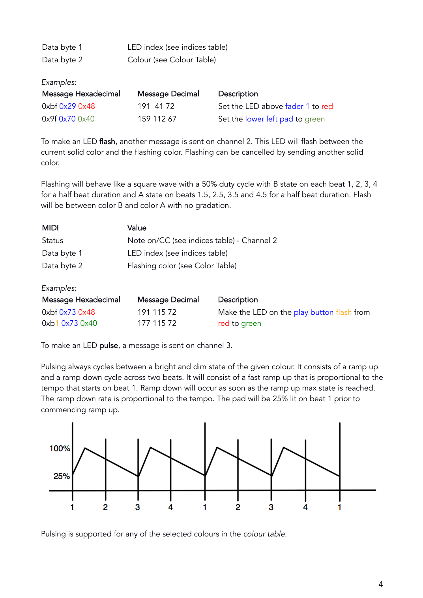

```text
4 
Data byte 1 LED index (see indices table) Data byte 2 Colour (see Colour Table)  Examples: Message Hexadecimal Message Decimal Description 0xbf 0x29 0x48 191  41 72 Set the LED above fader 1 to red 0x9f 0x70 0x40 159 112 67 Set the lower left pad to green  To make an LED flash, another message is sent on channel 2. This LED will flash between the current solid color and the flashing color. Flashing can be cancelled by sending another solid color.  Flashing will behave like a square wave with a 50% duty cycle with B state on each beat 1, 2, 3, 4 for a half beat duration and A state on beats 1.5, 2.5, 3.5 and 4.5 for a half beat duration. Flash will be between color B and color A with no gradation.  MIDI Value Status Note on/CC (see indices table) - Channel 2 Data byte 1 LED index (see indices table) Data byte 2 Flashing color (see Color Table)  Examples: Message Hexadecimal Message Decimal Description 0xbf 0x73 0x48 0xb1 0x73 0x40 191 115 72 177 115 72 Make the LED on the play button flash from red to green  To make an LED pulse, a message is sent on channel 3.  Pulsing always cycles between a bright and dim state of the given colour. It consists of a ramp up and a ramp down cycle across two beats. It will consist of a fast ramp up that is proportional to the tempo that starts on beat 1. Ramp down will occur as soon as the ramp up max state is reached. The ramp down rate is proportional to the tempo. The pad will be 25% lit on beat 1 prior to commencing ramp up. 
 Pulsing is supported for any of the selected colours in the colour table.
```

## Page 5

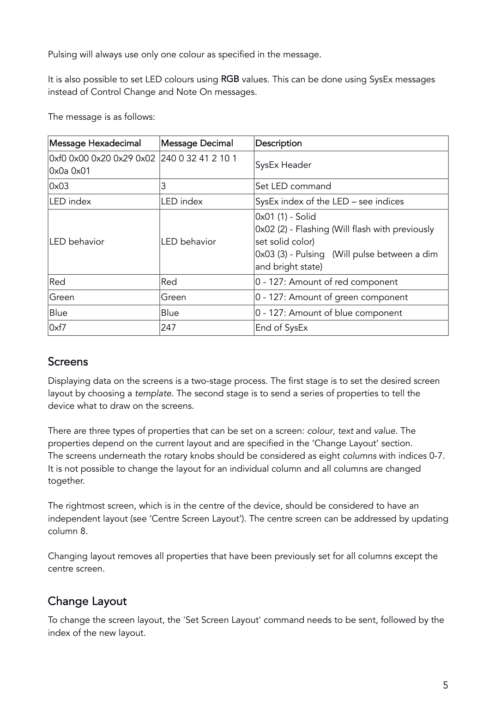

```text
5 
Pulsing will always use only one colour as specified in the message.  It is also possible to set LED colours using RGB values. This can be done using SysEx messages instead of Control Change and Note On messages.  The message is as follows:  Message Hexadecimal Message Decimal Description 0xf0 0x00 0x20 0x29 0x02 0x0a 0x01 240 0 32 41 2 10 1  SysEx Header 0x03 3 Set LED command LED index LED index SysEx index of the LED – see indices 
LED behavior LED behavior 0x01 (1) - Solid 0x02 (2) - Flashing (Will flash with previously set solid color) 0x03 (3) - Pulsing   (Will pulse between a dim and bright state) Red Red 0 - 127: Amount of red component Green Green 0 - 127: Amount of green component Blue Blue 0 - 127: Amount of blue component 0xf7 247 End of SysEx  Screens Displaying data on the screens is a two-stage process. The first stage is to set the desired screen layout by choosing a template. The second stage is to send a series of properties to tell the device what to draw on the screens.  There are three types of properties that can be set on a screen: colour, text and value. The properties depend on the current layout and are specified in the ‘Change Layout’ section. The screens underneath the rotary knobs should be considered as eight columns with indices 0-7. It is not possible to change the layout for an individual column and all columns are changed together.  The rightmost screen, which is in the centre of the device, should be considered to have an independent layout (see ‘Centre Screen Layout’). The centre screen can be addressed by updating column 8.  Changing layout removes all properties that have been previously set for all columns except the centre screen.  Change Layout To change the screen layout, the 'Set Screen Layout' command needs to be sent, followed by the index of the new layout.
```

## Page 6

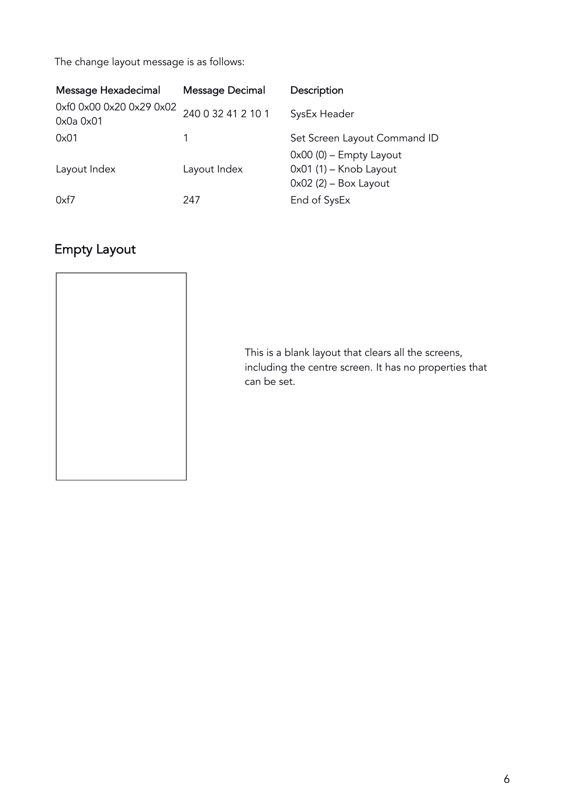

```text
6 
The change layout message is as follows:  Message Hexadecimal Message Decimal Description 0xf0 0x00 0x20 0x29 0x02 0x0a 0x01 240 0 32 41 2 10 1 SysEx Header 0x01 1 Set Screen Layout Command ID Layout Index Layout Index 0x00 (0) – Empty Layout 0x01 (1) – Knob Layout 0x02 (2) – Box Layout 0xf7 247 End of SysEx  Empty Layout                 
This is a blank layout that clears all the screens, including the centre screen. It has no properties that can be set.
```

## Page 7

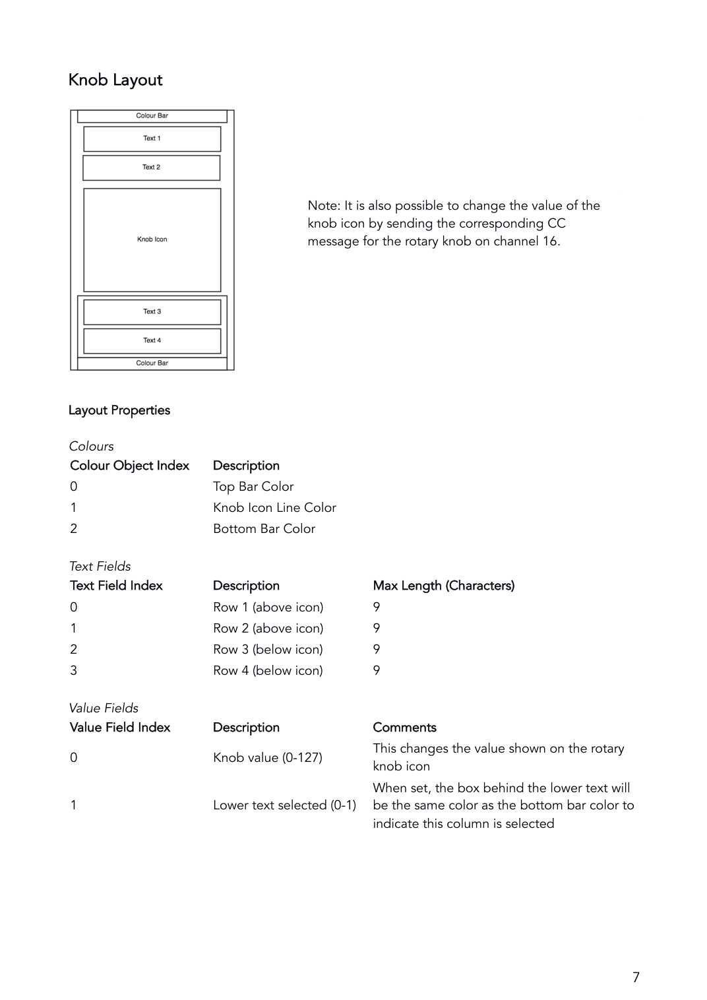

```text
7 
Knob Layout                  Layout Properties  Colours Colour Object Index Description 0 Top Bar Color 1 Knob Icon Line Color 2 Bottom Bar Color  Text Fields Text Field Index Description Max Length (Characters) 0 Row 1 (above icon) 9 1 Row 2 (above icon) 9 2 Row 3 (below icon) 9 3 Row 4 (below icon) 9  Value Fields Value Field Index Description Comments 0 Knob value (0-127) This changes the value shown on the rotary knob icon 1 Lower text selected (0-1) When set, the box behind the lower text will be the same color as the bottom bar color to indicate this column is selected    
Note: It is also possible to change the value of the knob icon by sending the corresponding CC message for the rotary knob on channel 16.
```

## Page 8

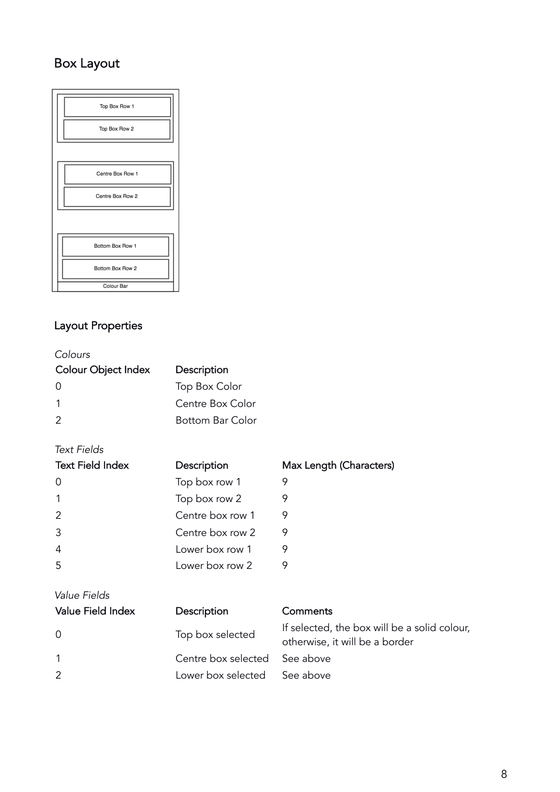

```text
8 
Box Layout                  Layout Properties  Colours Colour Object Index Description 0 Top Box Color 1 Centre Box Color 2 Bottom Bar Color  Text Fields Text Field Index Description Max Length (Characters) 0 Top box row 1 9 1 Top box row 2 9 2 Centre box row 1 9 3 Centre box row 2 9 4 Lower box row 1 9 5 Lower box row 2 9  Value Fields Value Field Index Description Comments 0 Top box selected If selected, the box will be a solid colour, otherwise, it will be a border 1 Centre box selected See above 2 Lower box selected See above
```

## Page 9

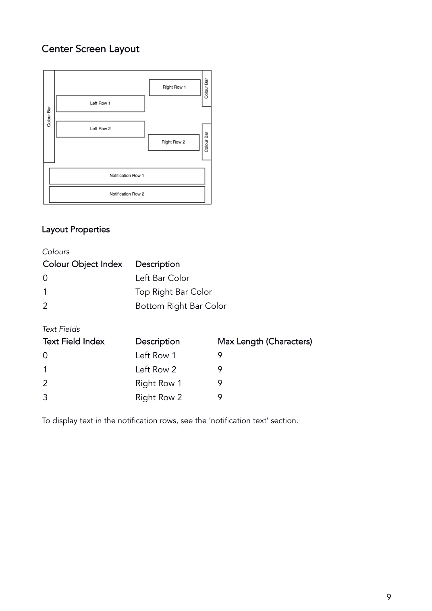

```text
9 
Center Screen Layout                Layout Properties  Colours Colour Object Index Description 0 Left Bar Color 1 Top Right Bar Color 2 Bottom Right Bar Color  Text Fields Text Field Index Description Max Length (Characters) 0 Left Row 1 9 1 Left Row 2 9 2 Right Row 1 9 3 Right Row 2 9  To display text in the notification rows, see the 'notification text' section.
```

## Page 10

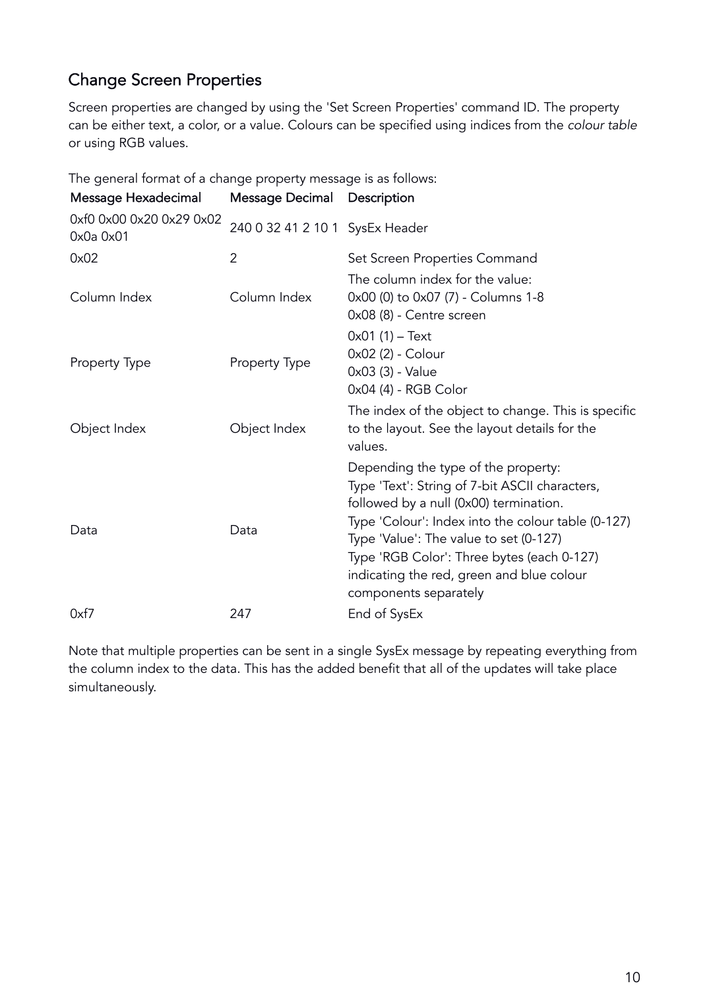

```text
10 
Change Screen Properties Screen properties are changed by using the 'Set Screen Properties' command ID. The property can be either text, a color, or a value. Colours can be specified using indices from the colour table or using RGB values.   The general format of a change property message is as follows: Message Hexadecimal Message Decimal Description 0xf0 0x00 0x20 0x29 0x02 0x0a 0x01 240 0 32 41 2 10 1 SysEx Header 0x02 2 Set Screen Properties Command Column Index Column Index The column index for the value: 0x00 (0) to 0x07 (7) - Columns 1-8 0x08 (8) - Centre screen 
Property Type Property Type 0x01 (1) – Text 0x02 (2) - Colour 0x03 (3) - Value 0x04 (4) - RGB Color Object Index Object Index The index of the object to change. This is specific to the layout. See the layout details for the values. 
Data Data 
Depending the type of the property: Type 'Text': String of 7-bit ASCII characters, followed by a null (0x00) termination. Type 'Colour': Index into the colour table (0-127) Type 'Value': The value to set (0-127) Type 'RGB Color': Three bytes (each 0-127) indicating the red, green and blue colour components separately 0xf7 247 End of SysEx  Note that multiple properties can be sent in a single SysEx message by repeating everything from the column index to the data. This has the added benefit that all of the updates will take place simultaneously.
```

## Page 11

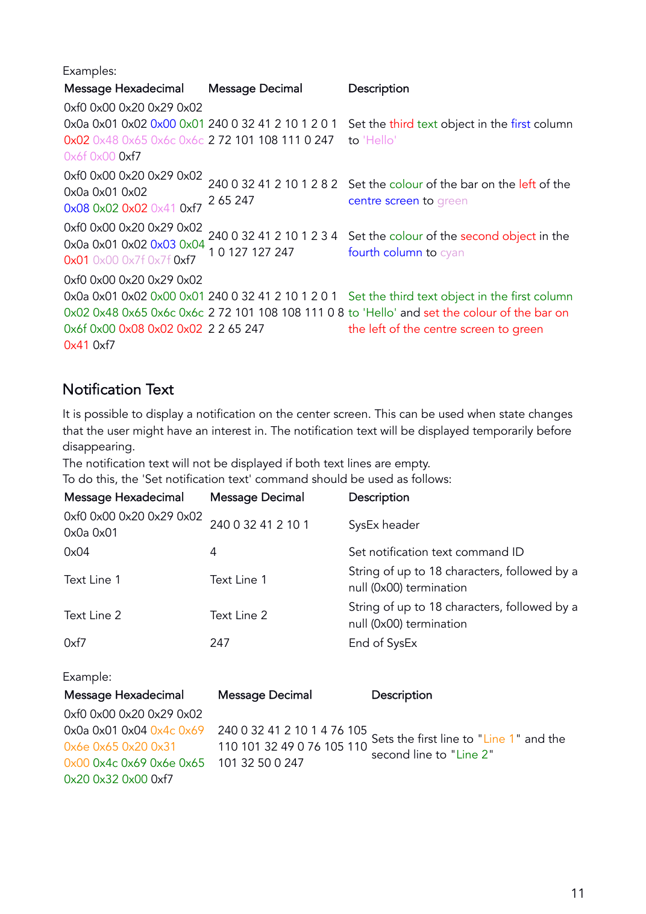

```text
11 
Examples: Message Hexadecimal Message Decimal Description 0xf0 0x00 0x20 0x29 0x02 0x0a 0x01 0x02 0x00 0x01 0x02 0x48 0x65 0x6c 0x6c 0x6f 0x00 0xf7 240 0 32 41 2 10 1 2 0 1 2 72 101 108 111 0 247 Set the third text object in the first column to 'Hello' 0xf0 0x00 0x20 0x29 0x02 0x0a 0x01 0x02 0x08 0x02 0x02 0x41 0xf7 240 0 32 41 2 10 1 2 8 2 2 65 247 Set the colour of the bar on the left of the centre screen to green 0xf0 0x00 0x20 0x29 0x02 0x0a 0x01 0x02 0x03 0x04 0x01 0x00 0x7f 0x7f 0xf7 240 0 32 41 2 10 1 2 3 4 1 0 127 127 247 Set the colour of the second object in the fourth column to cyan 0xf0 0x00 0x20 0x29 0x02 0x0a 0x01 0x02 0x00 0x01 0x02 0x48 0x65 0x6c 0x6c 0x6f 0x00 0x08 0x02 0x02 0x41 0xf7 
240 0 32 41 2 10 1 2 0 1 2 72 101 108 108 111 0 8 2 2 65 247 Set the third text object in the first column to 'Hello' and set the colour of the bar on the left of the centre screen to green   Notification Text It is possible to display a notification on the center screen. This can be used when state changes that the user might have an interest in. The notification text will be displayed temporarily before disappearing. The notification text will not be displayed if both text lines are empty. To do this, the 'Set notification text' command should be used as follows: Message Hexadecimal Message Decimal Description 0xf0 0x00 0x20 0x29 0x02 0x0a 0x01 240 0 32 41 2 10 1 SysEx header 0x04 4 Set notification text command ID Text Line 1 Text Line 1 String of up to 18 characters, followed by a null (0x00) termination Text Line 2 Text Line 2 String of up to 18 characters, followed by a null (0x00) termination 0xf7 247 End of SysEx  Example: Message Hexadecimal Message Decimal Description 0xf0 0x00 0x20 0x29 0x02 0x0a 0x01 0x04 0x4c 0x69 0x6e 0x65 0x20 0x31 0x00 0x4c 0x69 0x6e 0x65 0x20 0x32 0x00 0xf7 
240 0 32 41 2 10 1 4 76 105 110 101 32 49 0 76 105 110 101 32 50 0 247  Sets the first line to "Line 1" and the second line to "Line 2"
```

## Page 12

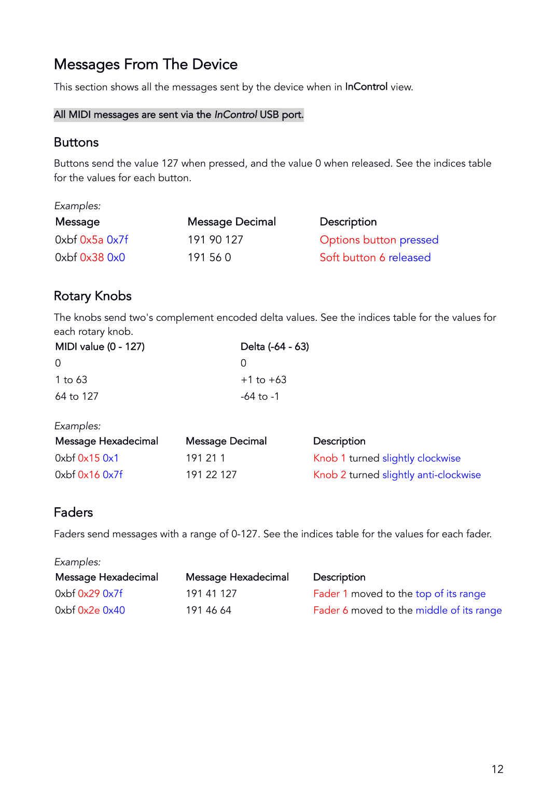

```text
12 
Messages From The Device This section shows all the messages sent by the device when in InControl view.  All MIDI messages are sent via the InControl USB port. Buttons Buttons send the value 127 when pressed, and the value 0 when released. See the indices table for the values for each button.  Examples: Message Message Decimal Description 0xbf 0x5a 0x7f  191 90 127  Options button pressed 0xbf 0x38 0x0  191 56 0 Soft button 6 released  Rotary Knobs The knobs send two's complement encoded delta values. See the indices table for the values for each rotary knob. MIDI value (0 - 127) Delta (-64 - 63) 0 0 1 to 63 +1 to +63 64 to 127 -64 to -1  Examples: Message Hexadecimal Message Decimal Description 0xbf 0x15 0x1  191 21 1 Knob 1 turned slightly clockwise 0xbf 0x16 0x7f  191 22 127 Knob 2 turned slightly anti-clockwise  Faders Faders send messages with a range of 0-127. See the indices table for the values for each fader.  Examples: Message Hexadecimal Message Hexadecimal Description 0xbf 0x29 0x7f  191 41 127 Fader 1 moved to the top of its range 0xbf 0x2e 0x40  191 46 64 Fader 6 moved to the middle of its range
```

## Page 13

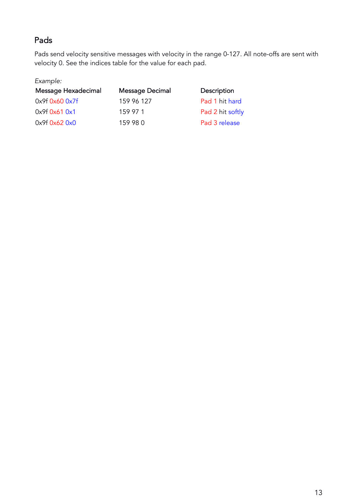

```text
13 
Pads Pads send velocity sensitive messages with velocity in the range 0-127. All note-offs are sent with velocity 0. See the indices table for the value for each pad.  Example: Message Hexadecimal Message Decimal Description 0x9f 0x60 0x7f 159 96 127 Pad 1 hit hard 0x9f 0x61 0x1  159 97 1 Pad 2 hit softly 0x9f 0x62 0x0  159 98 0 Pad 3 release
```

## Page 14

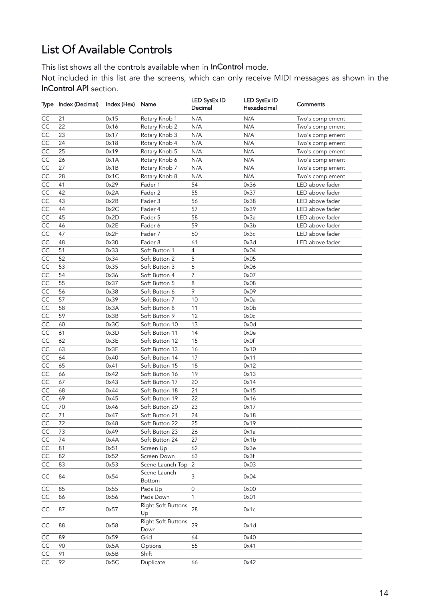

```text
14 
List Of Available Controls This list shows all the controls available when in InControl mode. Not included in this list are the screens, which can only receive MIDI messages as shown in the InControl API section. Type Index (Decimal) Index (Hex) Name LED SysEx ID Decimal LED SysEx ID Hexadecimal Comments CC 21 0x15 Rotary Knob 1 N/A N/A Two's complement CC 22 0x16 Rotary Knob 2 N/A N/A Two's complement CC 23 0x17 Rotary Knob 3 N/A  N/A Two's complement CC 24 0x18 Rotary Knob 4 N/A  N/A Two's complement CC 25 0x19 Rotary Knob 5 N/A N/A Two's complement CC 26 0x1A Rotary Knob 6 N/A N/A Two's complement CC 27 0x1B Rotary Knob 7 N/A N/A Two's complement CC 28 0x1C Rotary Knob 8 N/A N/A Two's complement CC 41 0x29 Fader 1 54 0x36 LED above fader CC 42 0x2A Fader 2 55 0x37 LED above fader CC 43 0x2B Fader 3 56 0x38 LED above fader CC 44 0x2C Fader 4 57 0x39 LED above fader CC 45 0x2D Fader 5 58 0x3a LED above fader CC 46 0x2E Fader 6 59 0x3b LED above fader CC 47 0x2F Fader 7 60 0x3c LED above fader CC 48 0x30 Fader 8 61 0x3d LED above fader CC 51 0x33 Soft Button 1 4 0x04   CC 52 0x34 Soft Button 2 5 0x05   CC 53 0x35 Soft Button 3 6 0x06   CC 54 0x36 Soft Button 4 7 0x07   CC 55 0x37 Soft Button 5 8 0x08   CC 56 0x38 Soft Button 6 9 0x09   CC 57 0x39 Soft Button 7 10 0x0a   CC 58 0x3A Soft Button 8 11 0x0b   CC 59 0x3B Soft Button 9 12 0x0c   CC 60 0x3C Soft Button 10 13 0x0d   CC 61 0x3D Soft Button 11 14 0x0e   CC 62 0x3E Soft Button 12 15 0x0f   CC 63 0x3F Soft Button 13 16 0x10   CC 64 0x40 Soft Button 14 17 0x11   CC 65 0x41 Soft Button 15 18 0x12   CC 66 0x42 Soft Button 16 19 0x13   CC 67 0x43 Soft Button 17 20 0x14   CC 68 0x44 Soft Button 18 21 0x15   CC 69 0x45 Soft Button 19 22 0x16   CC 70 0x46 Soft Button 20 23 0x17   CC 71 0x47 Soft Button 21 24 0x18   CC 72 0x48 Soft Button 22 25 0x19   CC 73 0x49 Soft Button 23 26 0x1a   CC 74 0x4A Soft Button 24 27 0x1b   CC 81 0x51 Screen Up 62 0x3e   CC 82 0x52 Screen Down 63 0x3f   CC 83 0x53 Scene Launch Top 2 0x03   CC 84 0x54 Scene Launch Bottom 3 0x04   CC 85 0x55 Pads Up 0 0x00   CC 86 0x56 Pads Down 1 0x01   CC 87 0x57 Right Soft Buttons Up 28 0x1c   CC 88 0x58 Right Soft Buttons Down 29 0x1d   CC 89 0x59 Grid 64 0x40   CC 90 0x5A Options 65 0x41   CC 91 0x5B Shift      CC 92 0x5C Duplicate 66 0x42
```

## Page 15

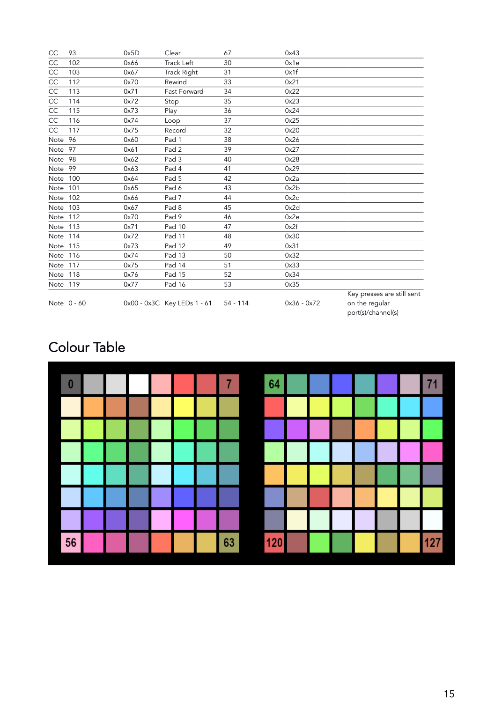

```text
15 
CC 93 0x5D Clear 67 0x43   CC 102 0x66 Track Left 30 0x1e   CC 103 0x67 Track Right 31 0x1f   CC 112 0x70 Rewind 33 0x21   CC 113 0x71 Fast Forward 34 0x22   CC 114 0x72 Stop 35 0x23   CC 115 0x73 Play 36 0x24   CC 116 0x74 Loop 37 0x25   CC 117 0x75 Record 32 0x20   Note 96 0x60 Pad 1 38 0x26   Note 97 0x61 Pad 2 39 0x27   Note 98 0x62 Pad 3 40 0x28   Note 99 0x63 Pad 4 41 0x29   Note 100 0x64 Pad 5 42 0x2a   Note 101 0x65 Pad 6 43 0x2b   Note 102 0x66 Pad 7 44 0x2c   Note 103 0x67 Pad 8 45 0x2d   Note 112 0x70 Pad 9 46 0x2e   Note 113 0x71 Pad 10 47 0x2f   Note 114 0x72 Pad 11 48 0x30   Note 115 0x73 Pad 12 49 0x31   Note 116 0x74 Pad 13 50 0x32   Note 117 0x75 Pad 14 51 0x33   Note 118 0x76 Pad 15 52 0x34   Note 119 0x77 Pad 16 53 0x35   Note 0 - 60 0x00 - 0x3C Key LEDs 1 - 61 54 - 114 0x36 - 0x72 Key presses are still sent on the regular port(s)/channel(s)  Colour Table
```

## Page 16

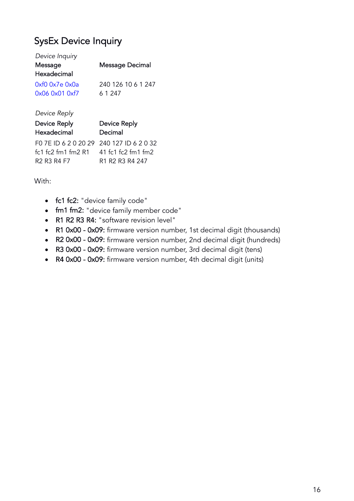

```text
16 
SysEx Device Inquiry Device Inquiry Message Hexadecimal Message Decimal 0xf0 0x7e 0x0a 0x06 0x01 0xf7 240 126 10 6 1 247 6 1 247  Device Reply   Device Reply Hexadecimal Device Reply Decimal F0 7E ID 6 2 0 20 29 fc1 fc2 fm1 fm2 R1 R2 R3 R4 F7 240 127 ID 6 2 0 32 41 fc1 fc2 fm1 fm2 R1 R2 R3 R4 247  With:  • fc1 fc2: "device family code" • fm1 fm2: "device family member code" • R1 R2 R3 R4: "software revision level" • R1 0x00 - 0x09: firmware version number, 1st decimal digit (thousands) • R2 0x00 - 0x09: firmware version number, 2nd decimal digit (hundreds) • R3 0x00 - 0x09: firmware version number, 3rd decimal digit (tens) • R4 0x00 - 0x09: firmware version number, 4th decimal digit (units)
```
